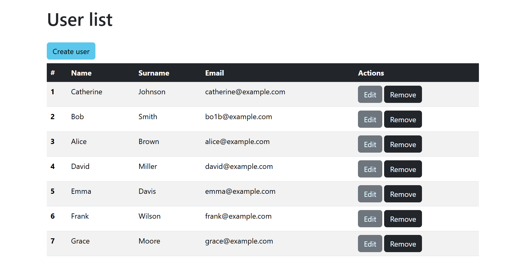
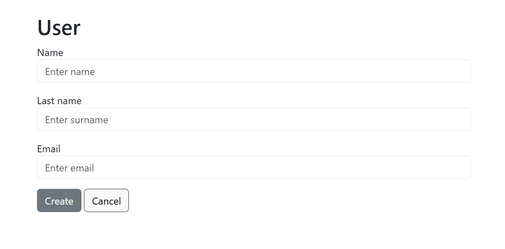

# Spring Boot + JPA

### Запуск проекта
1. Склонируйте проект `git clone https://github.com/sparklemod/spring-webmvc.git`
2. Запустите контейнер с БД `docker-compose up -d`
3. DВыполните команду `mvn spring-boot:run`

Таблица и начальные данные создаются автоматически

