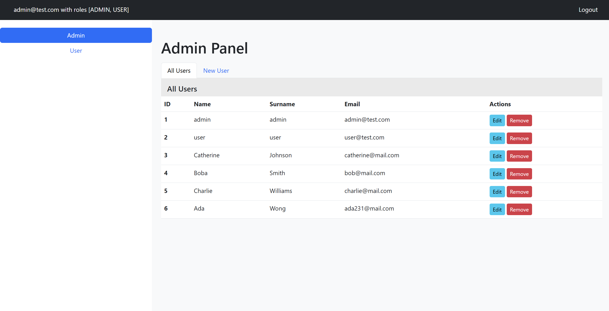
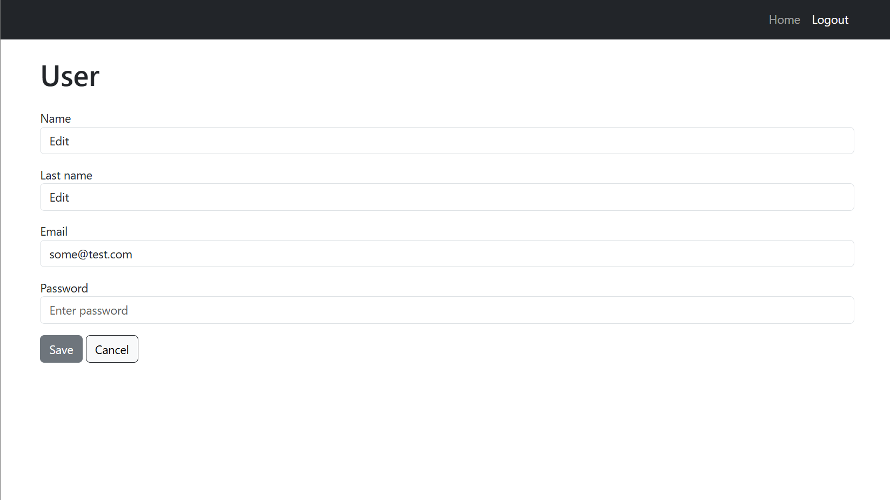
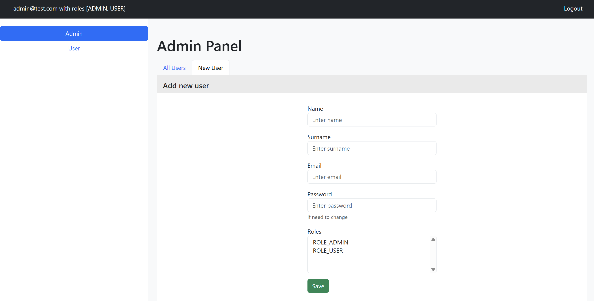
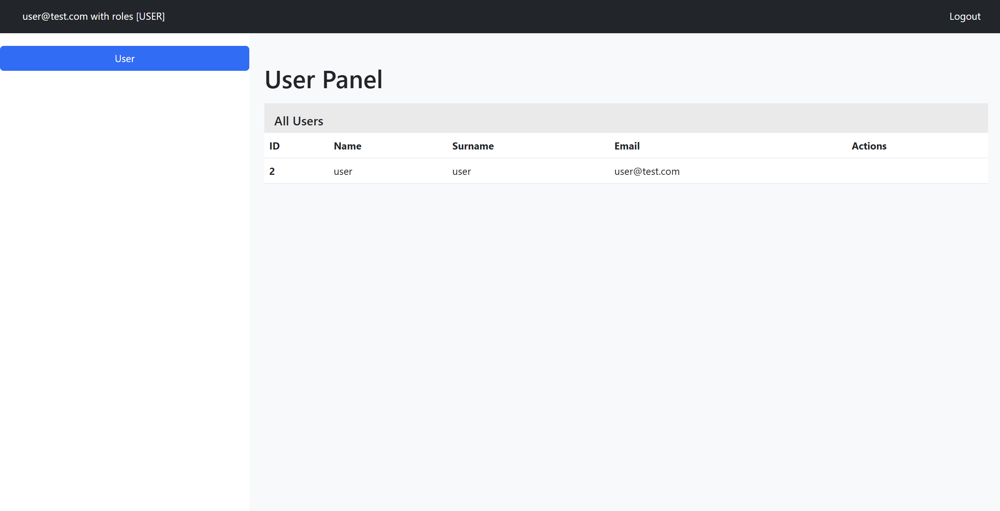
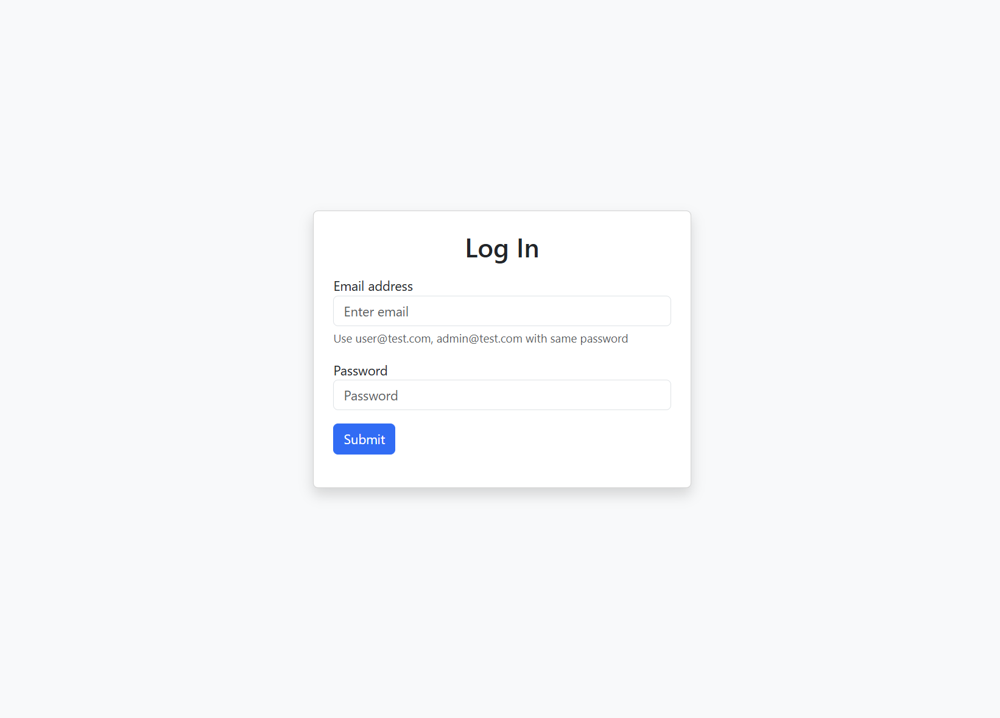

# Spring Boot + Spring Security + JPA

### Запуск проекта
1. Склонируйте проект `git clone https://github.com/sparklemod/spring-boot.git`
2. Запустите контейнер с БД `docker-compose up -d --build`
3. Выполните команду `mvn spring-boot:run`

Таблица и начальные данные создаются автоматически

Редактирование

Создание

Страница для пользователя

Форма авторизации

