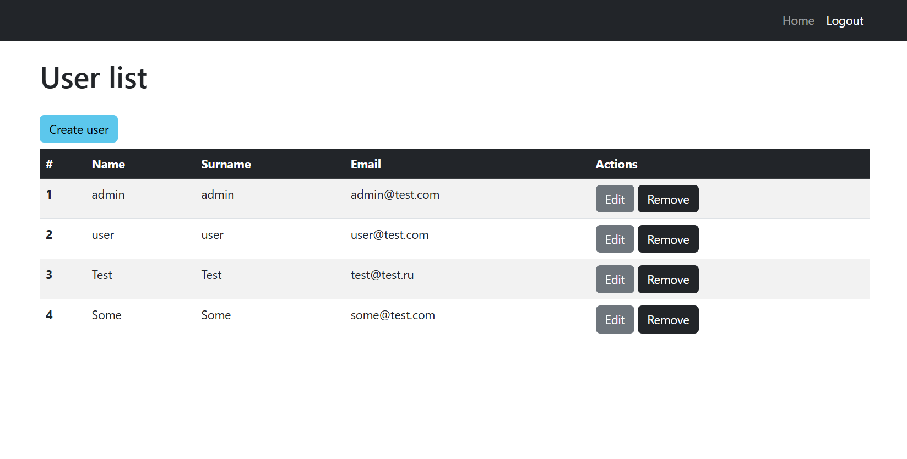

# Spring Boot + Spring Security + JPA

### Запуск проекта
1. Склонируйте проект `git clone https://github.com/sparklemod/spring-webmvc.git`
2. Перейдите на ветку `git checkout 4-2-spring-security`
3. Запустите контейнер с БД `docker-compose up -d --build`
4. Выполните команду `mvn spring-boot:run`

Таблица и начальные данные создаются автоматически

