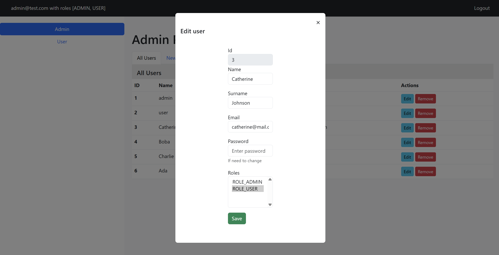

# Spring Boot + Spring Security + JPA (REST API)

### Launching the project
1. Add project `git clone https://github.com/sparklemod/spring-boot.git`
2. Run container with the DB `docker-compose up -d --build`
3. Run the command `mvn clean install spring-boot:run`

The table and initial data are created automatically

## Api
http://localhost:8080/swagger-ui/index.html

## Interface

Edit User

Create User

User Role Interface

Login form

